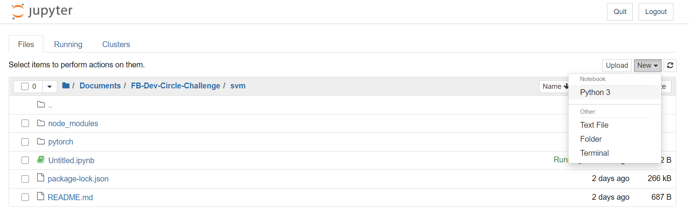
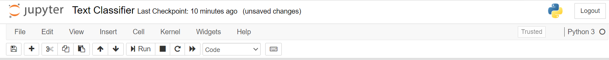

# Building a text classifier with PyTorch 

###### Source: https://pytorch.org/tutorials/beginner/text_sentiment_ngrams_tutorial.html

## What is PyTorch?

[PyTorch](https://pytorch.org/) is a framework that contains lots of modules to support machine learning and deep learning workloads. You can use PyTorch to train neural networks to [classify images](https://pytorch.org/tutorials/beginner/transfer_learning_tutorial.html), [do object detection](https://pytorch.org/tutorials/intermediate/torchvision_tutorial.html) all the way through to [classfiying text](https://pytorch.org/tutorials/beginner/text_sentiment_ngrams_tutorial.html) (which is the focus of this tutorial) and many, many more. It is well-integrated into Python (that programming language that has 'snaked' its way through to becoming one of the most popular languages used in data science and machine learning) and is designed to train models on GPU and CPU machines. 

## How do I get started?
You need to install PyTorch of course! But before you can do that, you need to make sure you have the following installed: 
> [Python](https://www.python.org/downloads/) (preferrably Python 3.x where x is a variable so just replace x with a number). For this tutorial, we are using Python 3.8.

> [Anaconda](https://docs.continuum.io/anaconda/) (not to be confused with Nicki Minaj's song, Anaconda is a package manager, environment manager and a Python data science distribution. When you install Anaconda, you get an Anaconda prompt and the Anaconda Navigator which allows you to install a LOT of Anaconda packages for free.) Remember to download 64-Bit Graphical Installer and not the 32-Bit Graphical Installer because you might run into issues later. 

> [Jupyter](https://jupyter.org/install) Notebooks allows us to execute our text classifier code in cells. You can install Jupyter with conda or pip. You can think of both conda and pip as package managers for python however conda can do more. While pip allows you install Python packages from [PyPI](https://pypi.org/), conda is actually cross-platform which means conda can also be used to install packages from C, C++, and R libraries. 

## Getting set up 

Open up Jupyter Notebook (Anaconda 3). 
This will browse to your localhost and open up one of your file system's directories. Create a folder and navigate into that folder. From there, create a new Python 3 notebook like so: 



Give your notebook some meaningful name like *'Text Classifier'*. 
In the first cell, execute the following code to check you are running the correct Python version. 

```python
# First we want to check what version of python we are running here: 
import sys
print("Python version: " + str(sys.version_info.major) + "." + str(sys.version_info.minor) + "." + str(sys.version_info.micro))
```

Once you have identified the version, add another cell below by clicking on the '+' sign from the toolbar at the top:



This will add another cell for you to run a separate block of code. In this cell, we want to install PyTorch: 

```python 
# Install PyTorch and TorchText
!pip install torch
!pip install torchtext
```

We can use either conda or pip to install PyTorch, I'm using pip here but either one works. Run that cell and once it successfully executes, we want to import the modules we have just installed to our environment: 

```python 
import torch
import torchtext
print("Successfully imported Torch and TorchText module from PyTorch.")
```

Now we want to load some of the datasets from TorchText: 

```python 
# Import some datasets from TorchText
from torchtext.datasets import text_classification
print("Successfully imported some datasets from TorchText.")
```


